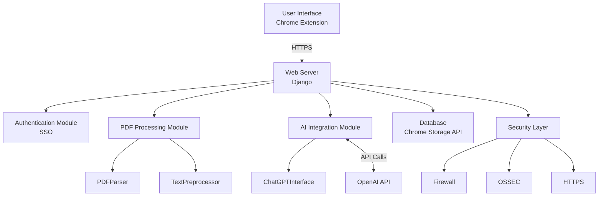
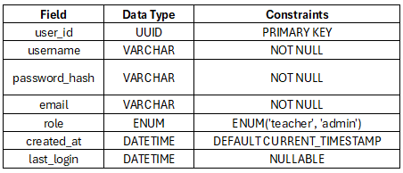
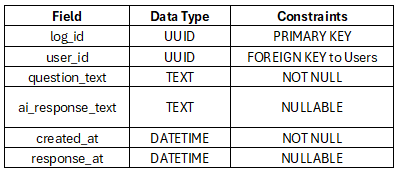
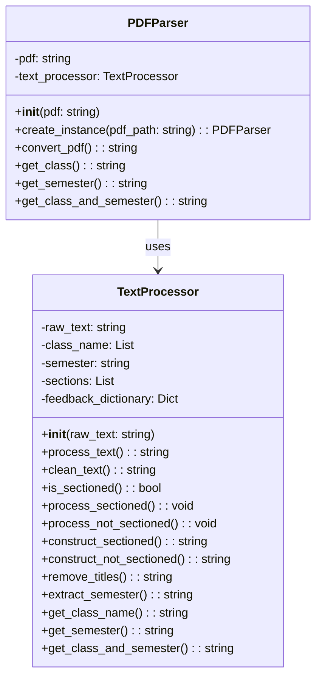
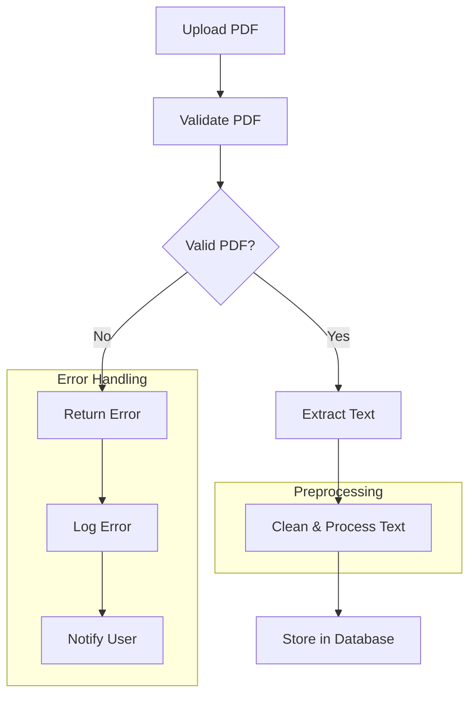
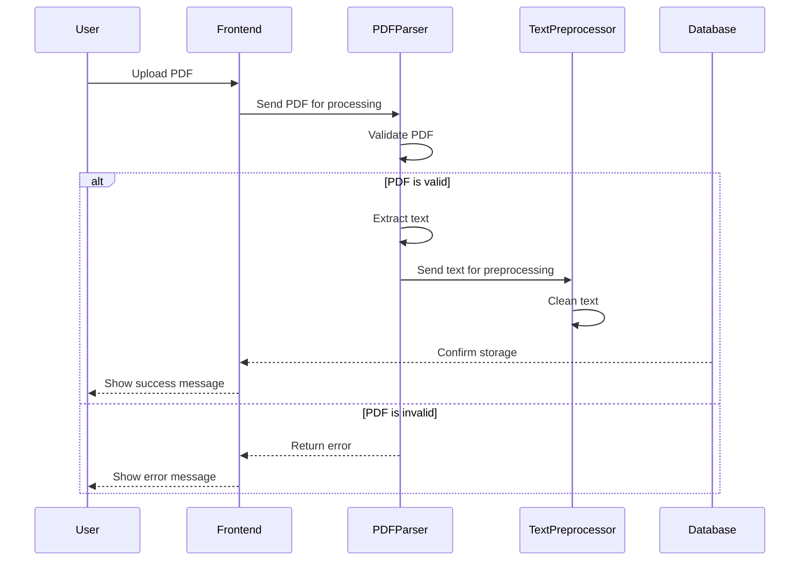
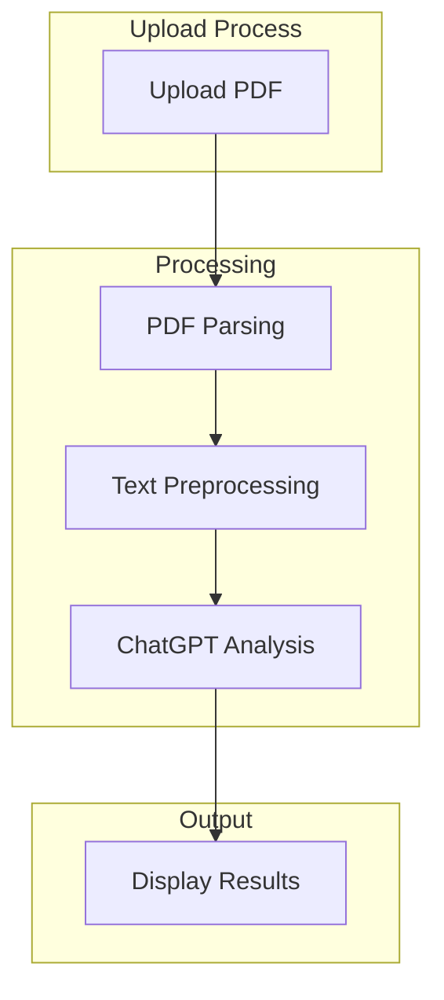

# IDE-AI-nator
THe IDE-AI-nator is a web application designed to help professors and administrators at Utah State University analyze student feedback from IDEA surveys students fill out at the end of each semester. The application allows PDF uploads of student feedback and uses OpenAI's GPT-4o-mini model to provide valuable insights from the student feedback.

Key componenents of the system are:
1. A front-end React Framework with SSO login and a dashboard for PDF upload 
2. A backend system for PDF processing, text extraction, and AI integration
3. A SQL for storing user data and chat logs
4. Integration with OpenAI's API for analyzing student feedback

## System Architecture Diagram



## Front-End

Login Page (with SSO):
  - SSO Login Button (Utah State University)
  - Redirect to USU's SSO page for authentication

  OnSSOLogin:
    - Redirect to USU SSO portal 
    - If successful, redirect back to the application dashboard with an authenticated session
    - If failure, show error message (SSO Authentication Failed)

Design:
  - Match USU branding (colors, logos, font style)
  - Include standard USU footer (privacy policy, contact information)
  - Responsive design to match other USU websites

Dashboard (Role: Teacher):
  - Upload PDF Section:
      - File Upload Button (for PDF)
      - Submit Button to upload the PDF
      - Show status of PDF upload ("Uploaded", "Processing", "Analyzed")

  OnPDFUpload:
    - POST to /uploadPDF API
    - Show success message when upload completes
    - Update status to "Processing" while analyzing

  - View Uploaded Data (Table):
      - Date of Upload
      - Status (Pending Analysis, Analyzed)
      - Download Link (Optional, if needed)

  - Ask a Question Section:
      - Select Analyzed Data (Dropdown to choose uploaded PDF)
      - Question Input Area (Textarea)
      - Submit Button to ask a question about the analyzed data

  OnQuestionSubmit:
    - POST to /askQuestion API with the selected data and question text
    - Show confirmation message when question is submitted

  - View AI Responses Section:
      - List of previously asked questions (Table: Question Text, Status: Answered/Unanswered)
      - Click to View AI Response (for answered questions)

Design:
  - Use a responsive grid or layout to match USU’s website style
  - Header with USU logo, and navigation similar to other USU apps
  - Clean and modern UI for file uploads, question asking, and AI response viewing
  - Utah State University colors (dark blue, white)
  - Consistent font and UI elements across the system

PDF Upload Modal:
  - Drag and Drop area for the PDF
  - Upload progress indicator
  - Success/Error notifications

  OnSubmit:
    - Call /uploadPDF API
    - Show "Processing" status until analysis is complete

When viewing AI-generated response:
  - Question: (Text of the question asked by the teacher)
  - AI Response: (Generated based on the PDF data)

  Ask Another Question Section:
    - Text Input Area (Textarea for typing a new question)
    - Submit Button to send the question to the system for further analysis

  OnSubmit:
    - POST to /askQuestion API with the question text
    - Show confirmation message that the question was submitted

## DataBase

Chrome Storage API

- The chrome.storage API will be used to implement the database into the chrome extension. It is the best tool for the job because of the built-in features
provided by google. It is literally built for the use on a chrome extension and in the chrome browser.
- While it is essential we have a working database, there will not be large amounts of data saved as the pdf files will not be saved on the chrome extension,
only queries and usage statistics will be saved
- Even if a user clears cache and browsing history, the data will remain

- JSON
  - The values are JSON serializable and stored as object properties

- Storage areas:
  - storage.session: holds data in memory for the duration of a session
  - storage.local: stores data locally and is cleared when the extension is removed
  - storage.managed: read-only storage for policy installed extensions and managed by system administrators 
  - storage.sync: if syncing enabled, data is synced to any chrome browser the user is logged into

- Useful methods/functions:
  - Tracking changes made to storage, add a listener to its onChanged event. This can be used to track usage of the extension per user
  - Clear: The clear function will remove all items from storage, can be used at request of admin or user
  - Get: The get function gets one or more item from storage, used frequently during use
  - getKeys: This will help in retrieving and putting data in storage
  - remove: This will remove items in storage, can be used to remove unwanted data or obselete data/information
  - set: Sets multiple items
  - setAccessLevel: Sets desired access level for storage area

- Keys: All functions will use keys to access storage items
  - String
  - Dictionary
  - List

Example functions:

(storage.sync)

chrome.storage.sync.set({ key: value }).then(() => {
  console.log("Value is set");
});

chrome.storage.sync.get(["key"]).then((result) => {
  console.log("Value currently is " + result.key);
});

(storage.session)

chrome.storage.session.set({ key: value }).then(() => {
  console.log("Value was set");
});

chrome.storage.session.get(["key"]).then((result) => {
  console.log("Value currently is " + result.key);
});


- Example Databases with types:

Login:



ChatLogs: 



## PDF To Text Conversion and ChatGPT Integration

### 1. PDF Parsing and Text Extraction
####  **Module Name:** `pdf_parser.py`
#### Functionality:
  - Read a PDF file, extract its text content, and pass it to the text processor for further processing. It returns th processed feedback text either split into sections or as a single block
#### Libraries/Tools
  - Python  pdfplumber Libary will be used to extract text from PDF files
  - text processor class will be used to handle the cleaning and categorization of the extracted text
#### Input
  - A PDF file containing student feedback
  - the file pat is validated using the PDFParser.create_instance() method
#### Output
  - a plain text string containing the cleaned and structured feedback text, organized by class sections (if applicable)

# PDF Parser Class Diagram



#### Algorithm
1. **Load PDF**: 
   - The `create_instance()` method validates the PDF file and checks if the file is a valid PDF. If the file is not a valid PDF, return None and print an error message

2. **Extract Text**: 
   - The `convert_pdf()` method opens the pdf and extracts text from all pages using pdfplumber
   - Extracted text is passed to the TextProcessor class for further cleaning and processing

3. **Post Processing**: 
   - Extracted text is cleaed using methods in the text processor, everything that is not quantitative data other than the class name and section is removed.

4. **Text Output**: 
   - The processed feedback is returned as a structured string, either segmented by feedback sections or as a single block.

#### PDF Processing Pipeline Flow Diagram



#### Error handling
  - **PDF Validation**: The create_instance method handles invalid PDFsby returning None and printing an error message when a file is not valid

#### Performance Considerations  
- **Chunk Processing**: For very large PDFs, consider processing in chunks to reduce memory usage
- **Asynchronous Processing**: Implement asynchronous loading for better responsiveness if the module is part of a larger application

#### PDF Processing Sequence Diagram



### 2. Text Preprocessing for ChatGPT
#### **Module Name:** `text_processor.py`
#### Functionality
  - This module handles the processing of raw text extracted from PDFs. It organizes feedback based on sections of feedback and if included by class section. It also removes unimportant information and ensures consistent formatting.
#### Libraries/Tools
  - No external libraries or tools are used in this module
#### Input:
  - A string the raw extracted student feedback
#### Output:
  - A cleaned and structured string containing categorized feedback and divided into class sections if applicable.

# Text Processor Class Diagram

  ```mermaid
  classDiagram
    class TextProcessor {
        -raw_text: string
        -class_name: List
        -semester: string
        -sections: List
        -feedback_dictionary: Dict
        +__init__(raw_text: string)
        +process_text(): string
        +clean_text(): string
        +is_sectioned(): bool
        +process_sectioned(): void
        +process_not_sectioned(): void
        +construct_sectioned(): string
        +construct_not_sectioned(): string
        +remove_titles(): string
        +extract_semester(): string
        +get_class_name(): string
        +get_semester(): string
        +get_class_and_semester(): string
    }
  ```


#### Algorithm:
  1. **Clean Text**: 
     - The `clean_text()` method removes excess information like non-qualitative feedback
  2. **Remove Titles**:
     - The `remove_titles()` method removes section titles from the raw text so they are not included in the feedback
  3. **Check for Sections**: 
     - The `is_sectioned()` method removes predefined titles from the raw text to prevent them from being included in the feedback
  4. **Segemnt Text**: 
     - If the feedback containes multiple class sections, the `process_sectioned()` method organizes the feedback into the appropriate section
     - If the feedback does not have sections, the `process_not_sectioned()` method organizes the feedback into a single block
  5. **Output Processed Text**:
     - The `process_text()` method returns the final processed and structured text, either organized by sections or as a single block.

#### Error Handling:
  - Handle large PDFs with a fallback mechanism to divide the content into manageable parts based on the token limits imposed by the ChatGPT model

#### Performance Considerations:
  - **Memory Mangement**: Text cleaning and processing should be done in memory-efficient ways (IDEA survey PDFs are generally small)

## 3. Integration with ChatGPT
#### **Module Name:** `ChatGPTInterface`
#### Functionality:
  - This module will interact with OpenAI's GPT-4o-mini modle to analyze the feedback data and provide summarized insights for faculty
#### Libraries/Tools:
  - `openai` Python library to interface with OpenAI's API
  - Jonny's OpenAI account with $10 credit wll be used for testing and deploymet
#### Input:
  - A cleaned and formatted string containing student feedback data from the `text_processor` module
  - Crafted prompt to extract meaningful feedback for the faculty
#### Output:
  - A response from GPT-4o-mini containing insightsor answers based on the processed student feedback
#### Algorithm:
  1. **Prepare Prompt:** Construct a prompt where ChatGPT is instructed to answer a specific question about the feedback from the perspective of the professor or administrator.
  2. **Send API Request:** Use OpenAI's `chat.completions.create()` function to send the request. The request will include the cleaned feedback and the constructed prompt
  3. **Handle Response:** Receive and extract the relevant part of the GPT-4o-mini response with only the core information is returned wthout any additional response text like "Sure ,here you go"
  4. **Truncate Large Requests:** If the totalfeedback exceeds GPT-4o-mini's token limit, split the text into smaller chunks, send multiple requests, and combine the responses
#### Error handling:
  - **API Errors:** Implemet retry logic in case of API timeouts, failed calls, or rate limits
  - **Token Limit Exceeded:** When the feedback exceeds the token limit, split the text ito multiple parts and combine the results after analysis
#### Performance Considerations:
  - **Token Usage:** Optimize the text passed to the API to avoid exceeding token limits and ensure efficient processing
  - **Error Recovery:** Include mechanisms to handle errors without interrupting the user experience like retires and error logging

#### Example Code:

```python
from openai import OpenAI
from key import api_key

def chat_gpt( question ):
    prompt="You are a helpful assistant and I am a teacher. I'm going to give you responses to a survey I gave to my class.  With that information, answer this question: "+question+"."
    
    response = client.chat.completions.create(
        model="gpt-4o-mini",
        messages=[{"role": "user", "content": prompt}]
    )
    r=response.choices[0].message.content
    return r 
```

## 4. System Flow
1. **Upload PDF**: Faculty uploads the PDF containing student feedback via the Chrome Extension or IDE-AI-nator interface
2. **PDF Parsing**: The `pdf_parser` module extracts the text from the PDF
3. **Text Preprocessing**: The extracted text is cleaned and formatted by the `text_processor`
4. **ChatCPT Analysis**: The cleaned text is passed to th ChatGPTInterface module, where it is analyzed by the GPT model
5. **Display Results**: The results are formatted and displayd in the IDE-AI-nator UI, allowing faculty to view and interpret the feedback analysis



## 5. Performance Considerations

#### 1. PDF Processing Performance Targets
- **PDF Validation Time**: 
  - **Target**: < 2 seconds for validation of the PDF file
- **Text Extraction Time**: 
  - **Target**: < 5 seconds for text extraction from a standard PDF file (up to 50 pages)
  - **Benchmark**: For larger PDFs (100+ pages), the target should be < 10 seconds, with optimizations for chunk processing
- **Text Cleaning and Preprocessing Time**: 
  - **Target**: < 3 seconds for cleaning and preprocessing the extracted text
- **Error Handling**: 
  - **Target**: 100% of errors (e.g., invalid PDFs, extraction failures) should be logged and returned to the user within 2 seconds of detection

#### 2. API Response Time Targets
- **ChatGPT API Response Time**: 
  - **Target**: < 3 seconds for a response from the ChatGPT API for standard queries
  - **Benchmark**: For more complex queries that may require longer processing, the target should be < 5 seconds
- **Error Handling for API Calls**: 
  - **Target**: 99% of API errors should be retried automatically, with a maximum retry delay of 2 seconds
- **Throughput**: 
  - **Target**: The system should handle at least 10 simultaneous requests to the ChatGPT API without significant degradation in response time

#### 3. Overall System Performance
- **End-to-End Processing Time**: 
  - **Target**: < 15 seconds from PDF upload to displaying results in the UI for standard-sized PDFs (up to 50 pages)
  - **Benchmark**: For larger PDFs (100+ pages), the target should be < 30 seconds
- **User Experience**: 
  - **Target**: 95% of users should receive feedback within the specified performance targets, ensuring a smooth experience during peak usage times

# Development By Sprints

## Sprint 1: PDF Processing and Core Backend
1. **Implement basic front-end structure**:
  - Create login page with SSO integration
  - Develop basic dashboard layout
  - Implement responsive design matching USU branding
2. **Establish database structure**:
  - Set up Chrome Storage API
  - Implement basic data models for user information and chat logs
3. **Develop PDF parsing module**:
  - Create `pdf_arser` class
  - Implement PDF validation and text extraction functions
  - Develop basic error handling for PDF processing
4. **Set up security measures**:
  - Configure firewall rules
  - implement user permission system
  - set up HTTPS for secure communication

## Sprint 2: Core Functionality and AI Integration
1. **Enhance front-end functionality**:
  - Implement PDF upload feature
  - Develop qustion input and submission system
  - Create AI response viewing section
2. **Develop text preprocessing module**:
  - Implement `text_processor` class
  - Create functions for cleaning and formatting extracted text
3. **Integrate ChatGPT**:
  - set up OpenAI API integration
  - implement `chat_gpt` function for question aswering
4. **Enhance database functionality**:
  - Develop data synchronization across Chrome browsers
5. **Improve security measures**:
  - Install and configure OSSEC for instrusion detection
  - Implement input validation for file uploads and user inputs
  
## Sprint 3: Refinement and Advanced Features
1. **Optimize PDF processing**:
  - Implement chunk processing for large PDFs
  - Develop asynchronous processing for better performance
2. **Enhance ChatGPT integration**:
  - Implement retry mechanisms for API calls
  - Develop token limit handling for large texts
3. **Implement front-end user experience**:
  - Implement real-time status updates for PDF processing and question answering
  - Develop advanced filtering and sorting for AI responses
4. **Enhance security and monitoring**:
  - Integrate OSSEC alerts with the React frontend
5. **Test and fix bugs**:
  - Conduct unit and integration tests for all components
  - adress any identified issues or bugs
  


# Security - Low-Level Design

## Operating System Security

### 1. Operating System Hardening:
- **Firewall Rules**: Configure inbound/outbound rules to restrict unnecessary ports and protocols.
- **User Permissions**: Ensure that processes run with the least privileges necessary.
- **Patch Management**: Utilize Utah State University’s patch management system to apply regular updates and security patches.

### 2. Intrusion Detection Systems (IDS):

#### Steps to Implement OSSEC for Securing the Backend (Server-Side)

1. **Install OSSEC on the Server**:
   - Install OSSEC on the Django server to monitor for any attacks, unauthorized access, file changes, or log anomalies.
   
2. **Configure OSSEC**:
   - After installation, configure OSSEC to monitor system logs (e.g., web server logs, application logs, database logs).
   - OSSEC will monitor logs of your web server and application to catch attacks, failed login attempts, and/or brute-force attempts.

3. **Alerting**:
   - Set up email notifications for real-time alerts when an intrusion is detected.
   - Configure OSSEC to automatically block IP addresses when suspicious behavior is detected.

4. **Secure Web Application Backend**:
   - OSSEC will monitor backend systems like databases, file servers, and web servers. It will raise an alert and log any intrusions such as SQL injection attempts or file tampering.
   - Integrate OSSEC's alerting system with the admin dashboard or monitoring tool in the React frontend to display security alerts.

   Example: Notify admins through the React frontend if the backend is compromised.

## Enhancing Security for the React Frontend

### 1. Secure Communication:
- Ensure that all data transmitted between the client (React) and the server is encrypted with TLS (HTTPS).

### 2. Cross-Site Scripting (XSS) Protection:
- React automatically escapes values embedded in JSX to protect against XSS. However, validate and sanitize all user inputs on both client and server sides.

### 3. Session Management:
- Use secure cookies for session management, flagged as HttpOnly and Secure to prevent JavaScript access and ensure encryption in transit.

### 4. Integrating OSSEC Alerts with React:
- Build an admin dashboard within React that consumes logs or alerts generated by OSSEC. This requires exposing the logs through a secure API and fetching them using React's data-fetching techniques.

## Application Security

### 1. Authentication & Authorization:
- **Microsoft 2FA Integration**: Leverage Azure AD's API for enforcing 2FA for every login attempt.
- **Role-Based Access Control (RBAC)**: Use middleware to check user roles (e.g., Instructor, Admin) and permissions before allowing access to specific endpoints.

### 2. Input Validation and Sanitization:
- **File Upload Validation**: Implement checks to ensure only valid PDFs are uploaded.
   - Check file headers for valid PDF format.
   - Limit file size (e.g., 20MB maximum).
- **Query Validation**: Use regular expressions to limit queries to allowed string formats.

### 3. SQL Injection Prevention:
- Use parameterized queries with libraries like psycopg2 or SQLAlchemy to prevent SQL injection.

## 4. Cross-Site Scripting (XSS) Protection:
- Implement Content Security Policy (CSP) headers to prevent unauthorized script execution.
- Use built-in framework protections like Django’s `XSSProtectionMiddleware` or React’s auto-sanitization.

## 5. Session Management:
- **Session Tokens**: Use secure cookies with HttpOnly and Secure flags for session management. Token-based authentication with short-lived tokens and refresh tokens for enhanced security.
- **Rate Limiting**: Apply rate limiting to login attempts to mitigate brute-force attacks using tools like nginx rate limiting or Flask-Limiter in Python.

# Network Security

## 1. TLS for Data Encryption in Transit:
- Enforce HTTPS using TLS 1.2 or higher for encrypting data transmission between client and server.
- Obtain and renew SSL/TLS certificates.

## 2. Firewall Configuration:
- Configure network firewalls to allow traffic only on necessary ports (e.g., 443 for HTTPS).
- Block non-essential incoming traffic and implement rate-limiting and IP whitelisting for administrative access.

# Data Security

## 1. Encryption at Rest:
- Use AES-256 encryption for sensitive data such as user passwords and login history.

## 2. Encryption in Transit:
- Encrypt all data exchanges, including PDF transfers and user queries, using TLS.

## 3. Data Masking and Anonymization:
- Anonymize sensitive information (e.g., replace student IDs with pseudonyms) before passing data to the system.
- Ensure that logs and queries with sensitive information do not expose private data to unauthorized users.

## 4. Audit Logging:
- Implement detailed logging with timestamps for critical actions like logins, file uploads, and query submissions.

# Secure Software Development Practices

## 1. Code Reviews:
- All code undergoes peer review to ensure compliance with security standards before deployment.

## 2. Use of Secure Libraries:
- Regularly update third-party libraries and ensure they come from trusted sources.

## 3. Version Control:
- Implement secure version control practices (e.g., GitHub with multi-factor authentication and branch protection).

