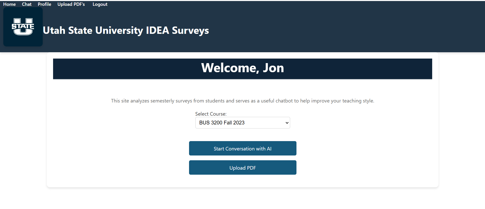
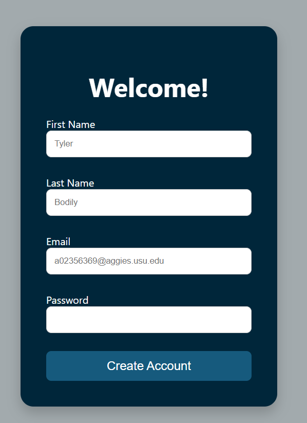
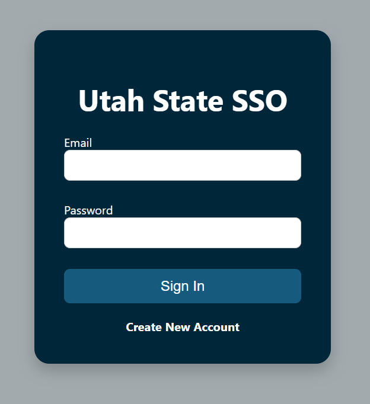
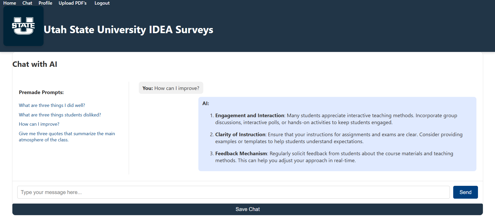
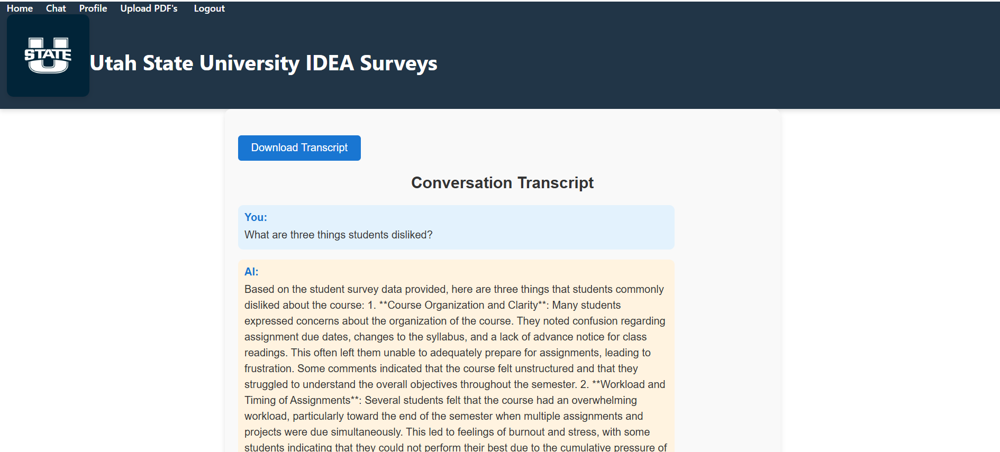
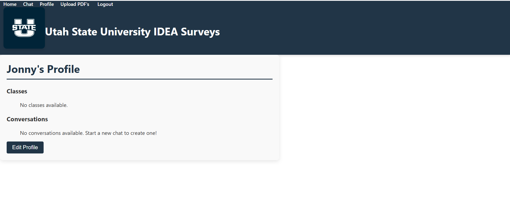
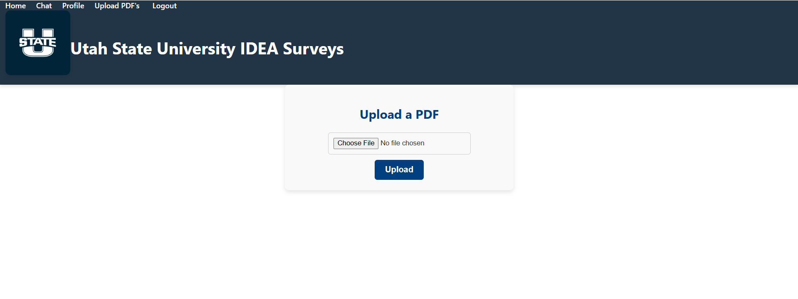

# **User Manual for IdeAInator**

## **Introduction**
**Purpose:**  
IdeAInator is a web-based platform designed to simplify and streamline idea generation, organization, and management. It provides users with tools to brainstorm, document, and refine class improvement ideas. The trained AI model handles both real time reports, as well as reaches valuable resources across the web to give tailored advice, and trusted methods to improve a students experience in the class. The platform leverages a clean interface and robust backend functionality to ensure a smooth and efficient user experience.

**Why It's Important:**  
- Simplifies the process of brainstorming and idea tracking.  
- Reduces the overhead of organizing ideas, enabling users to incorporate feedback from their constituents/students quickly. Allowing them to improve effectiveness of teaching, without the high time cost involved with self-analyzing the qrganized feedback.
- Provides an intuitive solution to bridge the gap between giving regular feedback, and the actual ability to allow it to be beneficial.

## **Website Navigation** 

#### **Home Page**

**What It Does:**  
- Serves as the landing page, allowing users to select a semester and course to begin interacting with the platform.  
- Provides a central hub for accessing key functionalities like the **Chat Page** and file upload.  

**How to Use It:**  
1. Log in to your account to access the Home Page.    
3. Use the **Course Dropdown** to select a course (dynamically loads from your profile).  
4. Click the **Start Conversation with AI** button to navigate to the **Chat Page** for real-time feedback and advice.  
---

### **User Authentication**
1. **Sign Up**:  

   - Visit the *Sign In* page.  
   - Fill in the required fields (e.g., email, password).  
   - Submit the form to create your account.  

2. **Log In**:  

   - Go to the *localhost:8000/*.  
   - Enter your credentials to access your account. 

---

### **Key Features and Pages**

#### **Chat Page**

**What It Does:**  
- Provides an interactive chatbot powered by AI to help analyze qualitative feedback from students.  
- The chatbot can quickly summarize, identify trends, and provide actionable advice for improving your teaching methods based on student comments.  

**How to Use It:**  
1. Navigate to the **Chat Page** by clicking the "Start Conversation with AI" button on the **Home Page**.  
2. Type a question or message in the input box. Examples:  
   - "What were the top three things students liked about this class?"  
   - "How can I improve student engagement?"  
3. Press **Send** to submit your query.  
4. Wait for the AI to respond with tailored advice.  
5. Use the **Save Chat** button to store the conversation in your profile for later review.

---

### **Transcript Page**

#### **What It Does:**
- Displays a detailed conversation transcript for a selected chat session.
- Includes a "Download Transcript" button that allows users to save the transcript as a `.txt` file for printing or future reference.

#### **How to Use It:**
1. Navigate to the **Profile Page**.
2. Under the **Conversations Section**, click on the link for the desired conversation (e.g., "Conversation 1").
   - This will open the **Transcript Page** for that conversation.
3. Review the conversation transcript, displayed in an easy-to-read format.
4. To download the transcript:
   - Click the **Download Transcript** button at the top-right corner of the page.
   - The transcript will be saved as a `.txt` file with a filename like `transcript_<id>.txt`, where `<id>` is the conversation ID.

#### **Additional Notes:**
- Each transcript is formatted with clear speaker labels (e.g., "You" and "AI").
- Use the downloaded transcript for record-keeping or offline review.

---

### **Profile Page**

#### **What It Does:**
- Displays user-specific information, including enrolled classes and saved conversations.
- Allows users to edit their profile information, such as adding or removing classes.
- Provides links to access detailed transcripts for each saved conversation.

#### **How to Use It:**
1. Navigate to the **Profile Page** from the menu.
2. **Classes Section**:
   - View your enrolled classes.
   - In edit mode, add or remove classes by typing class names separated by commas.
3. **Conversations Section**:
   - View saved conversations as links (e.g., "Conversation 1").
   - Click on a conversation link to navigate to the **Transcript Page** for that conversation.
4. To edit profile information:
   - Click the **Edit Profile** button.
   - Modify the desired fields.
   - Save your changes by clicking the **Save** button.
   
 ---

#### **Upload PDF Page**

**What It Does:**  
- Allows users to upload IDEA survey PDF files for analysis.  
- Processes the uploaded file to extract and summarize qualitative feedback from students.  

**How to Use It:**  
1. Navigate to the **Upload PDF Page** from the menu.  
2. Click on the **Choose File** button to open the file explorer.  
3. Select the desired PDF file (must be an IDEA survey) and click **Open**.  
4. Verify that the file name appears on the page.  
5. Click the **Upload** button to process the file.  
6. Wait for the confirmation message: **"File uploaded successfully!"**  
7. Access the analysis results through the chatbot dropdowns on the Home page.  

---

## **System Overview**
The system consists of a React-based frontend and a Django backend:  
- **Frontend**: Users interact with features through a clean, user-friendly interface.  
  - **Technology**: React + Vite.  
  - **Location**: All frontend assets are in the `client` directory.  

- **Backend**: Handles authentication, database management, and API endpoints.  
  - **Technology**: Django.  
  - **Location**: Backend assets are in the `_server` directory.  

---

## **Requirements**
1. **Supported Browsers**:  
   - Chrome  
   - Firefox  
   - Safari  

2. **Platform Compatibility**:  
   - Windows  
   - macOS  
   - Linux  

---

## **Setting Up the Project**
1. **Frontend**:  
   - Install Node.js and npm.  
   - Navigate to the `client` directory.  
   - Run `npm install` to install dependencies.  

2.  **Backend Setup**:

   - Install [Poetry](https://python-poetry.org/) for dependency management:
   - Follow the [official Poetry installation guide](https://python-poetry.org/docs/#installation) for your operating system.

   - Open a terminal and navigate to the backend project directory (e.g., `cd ideAInator/_server`)
  
   - Set up the database by running `python manage.py makemigrations`.  
   - Finalize by running `python manage.py migrate`. 
   - Start the backend by running `python manage.py runserver 
   

3. **Running the Application**:  
   - Start the backend server with `python manage.py runserver`.  
   - Start the frontend server with `npm run dev` in the `client` directory.  

---

## **Troubleshooting**
1. **Frontend Issues**:  
   - Ensure Node.js is installed.  
   - Verify all dependencies are correctly installed.  

2. **Backend Issues**:  
   - Check that Django is installed.  
   - Ensure the database is properly migrated.  

---

## **Testing**
- Unit tests are available to ensure the app functions as expected.  
- Run frontend tests with `npm test`.  
- Run backend tests with `python manage.py test`.  

---

## **File Uploading**
- Navigate to the Upload PDF's Page
- To upload a pdf click on the "Choose File" Button
- After you click on the button your File Explorer will pop up
- Navigate to the file that you would like to upload
   - File should be a pdf
   - This file should be an IDEA survey if you would like the correct output
- After you find the correct file click on the file and then the open button
- That file name should show up on the page now
- After that name shows up click the "Upload" button 
- If it says "File uploaded successfully!" your file should be uploaded

---

